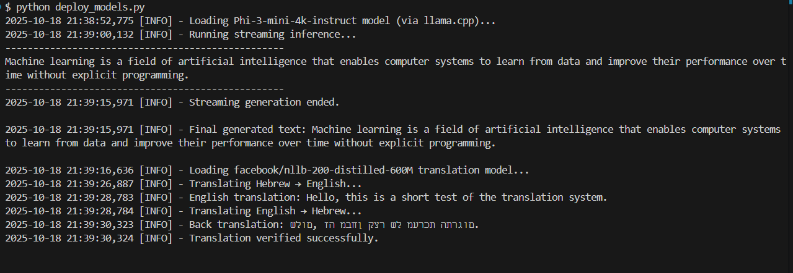
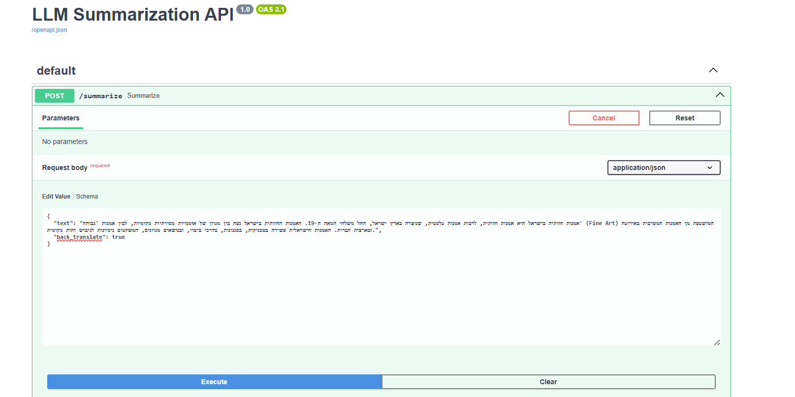

# LLM Summarization & Translation API

## Project Overview
This repository provides a streaming API for summarizing Hebrew text using open-source LLMs. 
It translates Hebrew to English, generates concise 5-bullet summaries, and optionally back-translates into Hebrew in real-time. 

---

## Table of Contents

## Table of Contents

- [Project Overview](#project-overview)
- [Components](#components)
- [Models Used](#models-used)
- [Getting Started](#getting-started)
  - [Minimum Requirements](#minimum-requirements)
  - [Clone the Repository](#1-clone-the-repository)
  - [Install Dependencies](#2-install-dependencies)
  - [Verify Model Deployment](#3-verify-model-deployment)
  - [Run the FastAPI Server](#4-run-the-fastapi-server)
  - [Send Example Requests](#5-send-example-requests)
- [Folder Overview](#folder-overview)
- [ML Engineer Assessment Deliverables](#ml-engineer-assessment-deliverables)
  - [Part 1: Model Deployment](#part-1-model-deployment)
  - [Part 2: FastAPI `/summarize` Endpoint](#part-2-fastapi-summarize-endpoint)
  - [Part 3: Stream with Translation Model](#part-3-stream-with-translation-model)
  - [Part 4: Generation Parameters](#part-4-generation-parameters)
- [Code Overview & Process Documentation](#code-overview--process-documentation)
  - [`app/models/translator.py`](#appmodelstranslatorpy)
  - [`app/models/text_generator.py`](#appmodelstext_generatorpy)
  - [`app/models/summarizer.py`](#appmodelssummarizerpy)
  - [`app/models/streaming.py`](#appmodelsstreamingpy)
  - [`app/schemas.py`](#appschemaspy)
  - [`app/main.py`](#appmainpy)


---

## Components

| Feature | Description |
|----------|--------------|
| **Phi-3-mini-4k-instruct** | Text generation / summarization via `llama.cpp` |
| **facebook/nllb-200-distilled-600M** | Multilingual translation model |
| **FastAPI** | REST API serving `/summarize` endpoint with streaming |

---

## Models Used

- **Phi-3-mini-4k-instruct**  
  Downloaded manually from [Hugging Face Phi-3 Mini 4k Instruct GGUF](https://huggingface.co/microsoft/Phi-3-mini-4k-instruct-gguf/tree/main) and included in this repository for reference.  
  Used for text generation and summarization via `llama.cpp`.

- **facebook/nllb-200-distilled-600M**  
  Loaded dynamically via Hugging Face Transformers.  
  For more information: [model page](https://huggingface.co/facebook/nllb-200-distilled-600M).  
  Used for Hebrew↔English translation.

---


## Getting Started

### Minimum Requirements

- Python: 3.10+
- pip: >=23
- RAM: At least 8 GB (for CPU inference; less if using smaller models)

---

### 1. Clone the Repository
```bash
git clone https://github.com/yourusername/llm-summarization-api.git
cd llm-summarization-api
```

---


### 2. Install Dependencies

Create and activate a virtual environment:

```bash
python -m venv venv
source venv/bin/activate   # On Windows use: venv\Scripts\activate
```

Then install the required packages:

```bash
pip install -r requirements.txt
```

---

### 3. Verify Model Deployment

Before running the API, verify that both models load and work correctly:

```bash
python deploy_models.py
```

This will:

- Load the Phi-3-mini-4k-instruct model (for summarization)
- Load the facebook/nllb-200-distilled-600M model (for translation)
- Perform test generations and translations
- Print real-time streamed output and log messages

Successful verification will end with:

```python
[INFO] - Translation verified successfully.
```

### Note on Hebrew Output

On Windows terminals (PowerShell, CMD, or Git Bash), Hebrew text may appear reversed or misaligned when printed to the console.
This is only a display issue — the actual text is correctly processed and encoded.
To view Hebrew output properly, you can use a terminal with full Unicode RTL support (e.g., Windows Terminal or VS Code’s integrated terminal), or Save the output to a UTF-8 file and open it in a text editor.

---

### 4. Run the FastAPI Server

To start the API locally, run:

```
uvicorn app.main:app --host 127.0.0.1 --port 8000 --reload
```

Once running, open http://127.0.0.1:8000/docs to explore the interactive Swagger UI.

---

### 5. Send Example Requests

You can use either cURL or the provided Python client:

Using `curl`

```bash 
curl -X POST "http://127.0.0.1:8000/summarize" \
     -H "Content-Type: application/json" \
     -d @examples/basic_input.json
```

Using `curl` with Streaming Output
```bash
curl -N -X POST "http://127.0.0.1:8000/summarize" \
     -H "Content-Type: application/json" \
     -d @examples/basic_input.json
```

Note: On some terminals (like Git Bash on Windows), output may already appear streamed even without -N.
The -N flag ensures consistent streaming behavior on all systems.

#### Note on Hebrew text and Windows terminals
When sending Hebrew (or any non-ASCII text) via `curl` on Windows, the built-in console may not
encode the request body in UTF-8. To ensure correct behavior, save your request as a UTF-8 JSON file
(e.g., `input.json`) and send it using:

```bash
curl -X POST "http://127.0.0.1:8000/summarize" ^
     -H "Content-Type: application/json; charset=utf-8" ^
     --data-binary "@input.json"
```


Using the Python client

```bash
python examples/client_test.py
```

You can also send requests directly from the FastAPI Swagger UI at http://127.0.0.1:8000/docs

1. Click the /summarize POST endpoint.
2. Click “Try it out”.
3. Fill in the request JSON (e.g., text, temperature, max_tokens, etc.).
4. Click “Execute”.

Request example:


Result:


Notes:

- The UI will send a normal POST request and wait for the full response.
- Streaming is not visible in real-time in the UI, you will only see the complete summary after the model finishes generating.
- To see live streaming output, use curl or the Python requests client with streaming enabled.

---

## Folder Overview

```bash
## Project Structure

llm-summarization-api/
│   .gitignore
│   LICENSE
│   README.md
│   requirements.txt
│   deploy_models.py          # Script to verify model deployment
│   Phi-3-mini-4k-instruct-q4.gguf  # Model file for reference
│
├── app
│   │   main.py              # FastAPI entry point
│   │   schemas.py           # Request/response Pydantic models
│   │   __init__.py
│   │
│   └── models
│       │   streaming.py
│       │   summarizer.py
│       │   text_generator.py
│       │   translator.py
│       │   __init__.py
│
├── assets
│   └── screenshots          # Example request/response screenshots
│
└── examples                 # Sample JSON requests, Python test client, curl commands
```

---

## ML Engineer Assessment deliverables:

### Part 1: Model Deployment

The [`deploy_models.py`](./deploy_models.py) script demonstrates and verifies deployment of both models.

- **Phi-3-mini-4k-instruct** via `llama.cpp` for text generation
- **facebook/nllb-200-distilled-600M** via Hugging Face Transformers for translation

#### Run the verification

```bash
python deploy_models.py
```

Output includes log lines confirming both models are loaded and working:



---

### Part 2: FastAPI `/summarize` Endpoint

**Deliverables:**

1. **FastAPI Application**  
   - File: [`app/main.py`](./app/main.py)  
   - Implements the `/summarize` POST endpoint.  
   - Supports streaming Hebrew → English → Hebrew summarization with optional back-translation.  

2. **Example Requests**  
   - Stored in the [`examples/`](examples) folder.  
   - Includes:
     - JSON inputs
     - cURL commands for Windows/macOS/Linux
     - Python client script (`examples/client_test.py`)  
   - Demonstrates basic summarization and back-translation.

3. **Visual Output**  

**Example 1:**

input:
```json
{
  "text": "אמנות היא שם כולל לתחום בתרבות האנושית בו מבטא האדם רעיונות וחוויות באמצעות שימוש בדמיון, בכישרון ובמיומנויות נרכשות. לרוב, הגדרה רחבה זו מתייחסת לשלל פעילויות שאינן נעשות על פי תבנית פעולה קבועה, מחייבת ומוגדרת מראש, אלא נתונה לשיקול דעתו, פרשנותו ויצירתיותו של האמן, ומתבססת על כישרונו המיוחד. בתחום האמנות נכללים ענפים רבים ומגוונים אשר נתפשים כתוצר וכביטוי של התרבות האנושית."
}
```


```bash
curl -X POST "http://127.0.0.1:8000/summarize" \
     -H "Content-Type: application/json; charset=utf-8" \
     --data-binary @examples/basic_input.json
```
Response:


**Example 2:**

input:
```json
{
  "text": "סרט הוא יצירה ויזואלית, ולכן התמונות הן מרכיב עיקרי בו. מאפיין מובהק של הצילומים הוא הצבע, אשר לו שתי וריאציות: שחור-לבן וצבע מלא. הצילום היה בתחילה שחור-לבן בלבד. מאמצע המאה העשרים הצילום בצבע הפך לסטנדרט, אולם השימוש בצילום שחור-לבן נמשך מטעמים אמנותיים או להשגת אפקטים שאי אפשר להשיגם בצילום צבע."
}
```

```bash
curl -X POST "http://127.0.0.1:8000/summarize" \
     -H "Content-Type: application/json; charset=utf-8" \
     --data-binary @examples/basic_input_2.json
```
Response:


**Example 3 - through the ui:**

input:
```json
{
  "text": "אמנות חזותית בישראל היא אמנות חזותית, לרבות אמנות פלסטית, שנוצרה בארץ ישראל, החל משלהי המאה ה-19. האמנות החזותית בישראל נעה בין מגוון של אוּמנויות מסורתיות מקומיות, לבין אמנות 'גבוהה' (Fine Art) המושפעת מן האמנות המערבית באירופה ובארצות הברית. האמנות הישראלית עשירה בטכניקות, בסגנונות, בדרכי ביטוי, ובנושאים מגוונים, המשקפים ניסיונות לגיבוש זהות מקומית."
}
```


Response:


---

### Part 3: Stream with Translation Model

**Deliverables:**

1. **Streaming Example**  
   - Shows the pipeline: Hebrew → English translation → summarization → optional Hebrew back-translation.  
   - Streaming is visible via cURL (`-N` flag) or Python streaming client.

2. **Example Requests and Responses**  

    **Example 1:**

    input:
    ```json
    {
    "text": "פרח לאומי או פרח סמלי נבחר על ידי מספר מדינות בעולם כדי לייצג את האזור הגאוגרפי שבו שוכנת המדינה ולעיתים אף את תרבותה. בחלק ממדינות העולם, בנוסף לפרח הלאומי, קיימים אף פרחים המסמלים אזורים בתוך המדינה. פרחים לאומיים של מדינות נבחרים בהליכים שונים, חלקם על ידי גופים ממשלתיים ובמקומות אחרים נערכות הצבעות ציבוריות לא רשמיות.",
    "back_translate": true
    }
    ```

    ```bash
    curl -X POST "http://127.0.0.1:8000/summarize" \
        -H "Content-Type: application/json; charset=utf-8" \
        --data-binary @examples/input_with_back_translation.json
    ```
    Response:

    

    ```
    • פרחים או צמחים סמליים נבחרים על ידי מדינות ברחבי העולם כדי לייצג את זהותם הגאוגרפית והתרבותית.
    • במדינות מסוימות יש פרחים מקומיים נוספים המייצגים אזורים ספציפיים בתוך המדינה.
    • תהליכים של הבחירה לפרחים לאומיים שונים, חלקם מבוצעים על ידי ארגונים ממשלתיים ואחרים באמצעות הצבעה ציבורית.
    • פרחים לאומיים משמשים כסמל המאחד את כל האומה.
    • בחירת פרח לאומי יכול לשקף משמעות היסטורית או תרבותית למדינה.
    ```


    **Example 2 - through the ui:**

    input:
    ```json
    {
    "text": "אמנות חזותית בישראל היא אמנות חזותית, לרבות אמנות פלסטית, שנוצרה בארץ ישראל, החל משלהי המאה ה-19. האמנות החזותית בישראל נעה בין מגוון של אוּמנויות מסורתיות מקומיות, לבין אמנות 'גבוהה' (Fine Art) המושפעת מן האמנות המערבית באירופה ובארצות הברית. האמנות הישראלית עשירה בטכניקות, בסגנונות, בדרכי ביטוי, ובנושאים מגוונים, המשקפים ניסיונות לגיבוש זהות מקומית.",
    "back_translate": true
    }
    ```

    

    Response:

    

    ```
    • אמנות חזותית בישראל כוללת אמנות פלסטית ואמנות מסורתית שנוצרות מאז סוף המאה ה-19.
    • הוא משקף שילוב של מסורות מקומיות ושל השפעות מערביות באמנות יפות אירופיות ואמריקות.
    • אמנות חזותית ישראלית מציגה טכניקות, סגנונות וביטויים שונים.
    • הנושא מייצג לעתים קרובות מאמץ להגדיר זהות מקומית ייחודית.
    • התמזגות זו מובילה לקליטה עשירה של ביטוי תרבותי ייחודי לארץ ישראל.
    ```

3. **Note**
    - Back-translation can be toggled with "back_translate": false.

---

### Part 4: Generation Parameters

The deliverables for this part demonstrate how the /summarize endpoint can be customized using generation parameters that influence the text output of the Phi-3-mini-4k-instruct model.

**1. Updated FastAPI Application -**
The API now accepts additional parameters in the request body:

```json
{
  "text": "Some Hebrew text here...",
  "temperature": 0.7,
  "top_p": 0.9,
  "top_k": 50,
  "repeat_penalty": 1.1,
  "max_tokens": 200,
  "back_translate": true
}
```

| Parameter          | Description                                                                                             | Effect on Output                                                                                                                | When to Adjust                                                                                                          |
| ------------------ | ------------------------------------------------------------------------------------------------------- | ------------------------------------------------------------------------------------------------------------------------------- | ----------------------------------------------------------------------------------------------------------------------- |
| **temperature**    | Controls randomness in token selection. Values between 0.0 and 1.0 (sometimes slightly higher allowed). | Low values (0–0.3) produce deterministic, predictable outputs. Higher values (0.7–1.0) produce more creative or varied outputs. | Use low values for summaries where consistency is important; high values for brainstorming or creative text generation. |
| **top_p**          | Nucleus sampling: only considers tokens whose cumulative probability is ≤ top_p.                        | Lower values (e.g., 0.8) make output more focused; higher values (0.95+) allow the model to explore more options.               | Lower top_p for precise output; higher top_p to increase variety without fully randomizing.                             |
| **top_k**          | Limits token selection to the k most probable tokens at each step.                                      | Smaller top_k (e.g., 20–40) constrains output, reducing randomness. Larger top_k (50–100+) allows more variation.               | Combine with temperature or top_p to balance creativity vs reliability.                                                 |
| **repeat_penalty** | Penalizes repeating the same tokens/phrases.                                                            | Values >1 discourage repetition; values <1 allow repetition.                                                                    | Increase to reduce redundancy in long summaries.                                                                        |
| **max_tokens**     | Maximum number of tokens to generate in the summary.                                                    | Controls length of output.                                                                                                      | Adjust based on desired summary length.                                                                                 |
| **back_translate** | If true, final output is translated back into Hebrew.                                                   | Enables a Hebrew summary instead of English output.                                                                             | Use when your end-user expects Hebrew text.                                                                             |

**2. Example Requests**
You can experiment with different parameter combinations. Each example shows the JSON input, the curl command, and a screenshot of the response.

**Example 1: Low temperature, conservative output**

```json
{
  "text": "הטכנולוגיה משפיעה על חיי היום יום שלנו בתחומים רבים, כולל תקשורת, בריאות וחינוך.",
  "temperature": 0.3,
  "top_p": 0.9,
  "top_k": 40,
  "repeat_penalty": 1.1,
  "max_tokens": 100,
  "back_translate": true
}
```

```bash
curl -X POST "http://127.0.0.1:8000/summarize" \
     -H "Content-Type: application/json" \
     -d @examples/input_low_temp.json
```

Response 1:
```bash
TRANSLATION: Technology is affecting our daily lives in many areas, including communications, health and education.

-------------------------------------------------- GENERATION --------------------------------------------------
• הטכנולוגיה משפיעה על היבטים שונים של חיי היום יום, כגון תקשורת ובריאות.
• בתחום החינוך, טכנולוגיה משחקת תפקיד משמעותי בעיצוב חוויות למידה.
• התקדמות בתכשירים טכנולוגיים שינתה את הדרך בה אנו מתקשרים אחד עם השני.
• שילוב הטכנולוגיה לרפואה שיפר את הטיפול בחולים וגישה לשירותים רפואיים.
• חדשנות טכנולוגיות ממשיכות להתפתח, שמשפיעות על גורמים רבים של החברה.
```

Response 2:
```bash
TRANSLATION: Technology is affecting our daily lives in many areas, including communications, health and education.

-------------------------------------------------- GENERATION --------------------------------------------------
• הטכנולוגיה משפיעה על היבטים שונים של חיי היום יום, כגון תקשורת וחינוך.
• גם בתחום הבריאות מתרחשים שינויים בשל ההתקדמות הטכנולוגית.
• חדשנות טכנולוגיות מעצבות מחדש את הדרך בה אנו מתקשרים ומחלפים מידע.
• מערכות החינוך מתאימות כדי לשלב טכנולוגיה בשיטות הוראה.
• שירותי הבריאות מתקבלים על תועלת מהבחנות והטיפול המתקדמים באמצעות ההתפתחות הטכנולוגית.
```

**Example 2: High temperature, more creative output**

```json
{
  "text": "הטכנולוגיה משפיעה על חיי היום יום שלנו בתחומים רבים, כולל תקשורת, בריאות וחינוך.",
  "temperature": 0.9,
  "top_p": 0.95,
  "top_k": 60,
  "repeat_penalty": 1.0,
  "max_tokens": 150,
  "back_translate": true
}
```

```bash
curl -X POST "http://127.0.0.1:8000/summarize" \
     -H "Content-Type: application/json" \
     -d @examples/input_high_temp.json
```

Response 1:
```bash
TRANSLATION: Technology is affecting our daily lives in many areas, including communications, health and education.

-------------------------------------------------- GENERATION --------------------------------------------------
• ההתקדמות הטכנולוגית מעצבת מחדש את התקשורת, הבריאות והחוויות החינוכיות.
• השפעת הטכנולוגיה מתרחשת לעניינים שונים של חיינו היומיומיים.
• חדשנות בטכנולוגיה משפרות את הגישה למידע ושירותים.
• הטכנולוגיה מרכיבה פערים ומשנה את הדרך בה אנו מתקשרים ולימודים.
• שילוב הטכנולוגיה במגוון מגזרים משפר את איכות החיים הכוללת.
```

Response 2:
```bash
TRANSLATION: Technology is affecting our daily lives in many areas, including communications, health and education.

-------------------------------------------------- GENERATION --------------------------------------------------
• הטכנולוגיה משפיעה משמעותית על היבטים שונים של חיי היומיום, כגון תקשורת, בריאות וחינוך.
• התקדמות הטכנולוגיה שינתה את הדרך בה אנו מתקשרים וקשרים עם אחרים.
• בתחום הבריאות, הטכנולוגיה הובילה לשיפור בתבחן הרפואי ובבחרי הטיפול.
• חדשנות טכנולוגית גם מהפכה את תחום החינוך, וניתן הזדמנויות וכלי לימוד חדשים.
• השפעת הטכנולוגיה ממשיכה להתרחב, להתפרץ ולשנות את אורח החיים שלנו בדרכים רבות.
```

**Example 3: Temperature = 0, fully deterministic output**

```json
{
  "text": "הטכנולוגיה משפיעה על חיי היום יום שלנו בתחומים רבים, כולל תקשורת, בריאות וחינוך.",
  "temperature": 0.0,
  "top_p": 0.9,
  "top_k": 40,
  "repeat_penalty": 1.1,
  "max_tokens": 100,
  "back_translate": true
}
```

```bash
curl -X POST "http://127.0.0.1:8000/summarize" \
     -H "Content-Type: application/json" \
     -d @examples/input_temp0.json
```

Response 1:

```bash
TRANSLATION: Technology is affecting our daily lives in many areas, including communications, health and education.

-------------------------------------------------- GENERATION --------------------------------------------------
• הטכנולוגיה משפיעה על היבטים שונים של חיי היום יום, כגון תקשורת ובריאות.
• היא גם ממלאת תפקיד משמעותי בתחום החינוך.
• ההשפעה של הטכנולוגיה מתרחבת לתחומים מרובים בחברה.
• התקדמות הטכנולוגיה מעצבת את הדרך בה אנו מתקשרים אחד עם השני.
• חדשנות מתמשכת מובילה לשינויים בגיוניות האישיות ובתקלילים של למידה.
```

Response 2:

```bash
TRANSLATION: Technology is affecting our daily lives in many areas, including communications, health and education.

-------------------------------------------------- GENERATION --------------------------------------------------
• הטכנולוגיה משפיעה על היבטים שונים של חיי היום יום, כגון תקשורת ובריאות.
• היא גם ממלאת תפקיד משמעותי בתחום החינוך.
• ההשפעה של הטכנולוגיה מתרחבת לתחומים מרובים בחברה.
• התקדמות הטכנולוגיה מעצבת את הדרך בה אנו מתקשרים אחד עם השני.
• חדשנות מתמשכת מובילה לשינויים בגיוניות האישיות ובתקלילים של למידה.
```

**Note on Temperature = 0 Responses:**  
When `temperature=0`, the model behaves deterministically. This means that repeated runs with the same input produce the same or nearly identical outputs.  

- **Response 1 and Response 2:** included to show that even when streaming or generating multiple times, the summary remains consistent.  
- Minor differences (if any) could appear due to streaming segmentation or tokenization, but in practice, the summaries are the same.


---

# Code Overview & Process Documentation

This section provides a detailed walkthrough of the key modules and design decisions 
made during the implementation of the Hebrew→English→Hebrew summarization pipeline. 
It documents the rationale behind each component, how streaming is handled, 
and the structure of the FastAPI `/summarize` endpoint.


## `app/models/translator.py`

### Purpose
This module provides a clean, modular wrapper around the `facebook/nllb-200-distilled-600M` model from Hugging Face.  
It is responsible for translating between Hebrew and English (or any supported language pair) and is later used in the `/summarize` FastAPI endpoint.

### Key Design Decisions

1. **Encapsulation in a Dedicated Class (`Translator`)**  
   - Keeps translation logic isolated and reusable.  
   - Makes it easier to replace or upgrade the model later without affecting the rest of the codebase.  
   - Follows the **Single Responsibility Principle** from clean code practices.

2. **Deterministic by Default, Sampling Optional**  
   - By default, translation uses *greedy decoding* for consistency and reproducibility.  
   - Sampling parameters (`temperature`, `top_p`) can be optionally passed to enable more diverse translations when desired.  

3. **Whitespace Cleaning with `.strip()`**  
   - Many models generate extra newlines or spaces.  
   - `.strip()` ensures clean, well-formatted output suitable for APIs and streaming responses.  
   - Avoids subtle formatting issues in JSON serialization or real-time text streaming.

4. **Flexible Sentence Splitting (`split_sentences`)**  
   - Uses a regular expression that works even for languages without capitalization (like Hebrew).  
   - Makes the translation more robust for long paragraphs.

### Example Usage

```python
from app.models.translator import Translator

translator = Translator()
result = translator.translate("שלום עולם", src_lang="heb_Hebr", tgt_lang="eng_Latn")
print(result)  # Output: Hello world
```

## `app/models/text_generator.py`

### Purpose
This module wraps the Phi-3-mini-4k-instruct LLaMA model for general-purpose text generation.
It supports both streaming generation (for real-time API responses) and non-streaming generation.

### Key Design Decisions

1. **Streaming Support by Default**  
   - Streaming allows clients to receive partial output in real-time.  
   - Useful for FastAPI endpoints where latency matters or when generating long summaries.

2. **Stop Token Handling (`stop="END SUMMARY"`)**  
   - Ensures generation ends cleanly without producing extra text.  
   - Handles edge cases where the stop token may be split across streaming chunks.

3. **Optional Generation Parameters**  
   - Users can pass parameters like `temperature` or `top_p` for creative text generation.  
   - Defaults remain safe and deterministic if no parameters are provided.

### Example Usage

```python
from app.models.text_generator import TextGenerator

generator = TextGenerator()
for chunk in generator.generate("Summarize the following text:", stream=True):
    print(chunk, end="")
```


## `app/models/summarizer.py`

### Purpose
This module generates structured prompts for summarization.  
It does not perform text generation itself instead, it ensures that the LLM receives a clear, deterministic instruction for producing exactly 5 bullet points.

### Key Design Decisions

1. **Separation of Concerns**  
   - The class only builds prompts, keeping summarization logic separate from text generation.  
   - This allows swapping or updating the LLM without changing prompt construction.

2. **Structured Prompting**  
   - Explicit instructions (number of bullets, bullet formatting, complete sentences, simple English) guide the model to produce output that is:
     - Concise and human-readable  
     - Directly translatable to Hebrew without idioms or complex phrasing  
     - Consistently 5 bullet points

3. **End Token for Streaming**  
   - Includes `"END SUMMARY"` as a stop phrase.  
   - Works with the `TextGenerator` streaming logic to signal the end of generation cleanly.

### Example Usage

```python
from app.models.summarizer import Summarizer

prompt = Summarizer.build_prompt("This is the text to summarize.")
print(prompt)
```

## `app/models/streaming.py`

### Purpose
This module orchestrates streaming translation and text generation, providing:
- Sentence-by-sentence translation from any language to English.
- Streaming text generation from an LLM.
- Optional translation of generated output back to the original language.

It is designed to be modular, using the `Translator` and `TextGenerator` classes.

### Key Design Decisions

1. **Streaming-first Design**  
   - Methods yield output as soon as it’s ready for low-latency API responses.  
   - Useful for FastAPI endpoints where users see text generated in real-time.

2. **Sentence-level Translation**  
   - Text is split into sentences for translation, ensuring that:
     - Long paragraphs don’t overwhelm the model.
     - Each sentence is processed independently for robustness.
  
3. **Separation of Concerns**  
   - `translate_and_stream` handles input translation.  
   - `generate_and_stream` handles text generation.  
   - `translate_stream` handles output translation back to the original language.  
   - Each method does one thing, making the pipeline modular and testable.

4. **Compatibility with Prompt Builders**  
   - `generate_and_stream` accepts a callable `prompt_builder`, so it can be used with:
     - Summarization
     - Q&A
     - Other text-generation tasks


## `app/schemas.py`

### Purpose
Defines structured, validated request models for the `/summarize` FastAPI endpoint.  
Ensures all inputs are type-checked and properly constrained, reducing runtime errors and providing clear API documentation.

### Key Design Decisions

1. **Separation of Concerns**
   - `GenerationParams` handles only LLM generation-related settings.
   - `SummarizeRequest` extends `GenerationParams` with endpoint-specific fields (`text`, `max_tokens`, `back_translate`).

2. **Validation and Constraints**
   - Pydantic types (`confloat`, `conint`) enforce valid ranges for generation parameters.
   - Prevents invalid values from reaching the model, reducing runtime errors.

3. **Defaults and Optional Fields**
   - Sensible defaults (e.g., `temperature=0.3`, `top_p=0.9`) allow users to submit minimal requests while keeping flexibility for tuning.
   - `back_translate` allows optional bonus feature without changing the API signature.

4. **API Documentation Integration**
   - `Field(..., description="...")` ensures automatically generated OpenAPI docs are clear and informative.

### Example Usage

```python
from app.schemas import SummarizeRequest

request = SummarizeRequest(
    text="שלום עולם",
    max_tokens=150,
    back_translate=True,
    temperature=0.7
)
print(request.dict())
```


## app/main.py

### `/summarize` Endpoint
Provides a streaming summarization API that:
1. Accepts Hebrew input text.
2. Translates it into English using the NLLB model.
3. Generates a 5-bullet-point summary with the Phi-3-mini-4k-instruct LLM.
4. Optionally back-translates each bullet into Hebrew while streaming.

### Key Design Decisions

#### 1. Wait for Full Translation Before Generation
- We first translate the entire Hebrew text to English before summarization.
- **Reasoning:**
  - Ensures the LLM sees a coherent, complete context.
  - Sentence-by-sentence translation could break context or generate incomplete ideas.
  - Improves overall accuracy and consistency of the generated summary.

#### 2. Bullet-by-Bullet Back-Translation
- When `back_translate=True`, we translate each bullet point separately.
- **Reasoning:**
  - Maintains clarity and sentence-level fidelity.
  - Prevents concatenation errors or mistranslations that could occur if we translated the entire summary as one block.
  - Allows streaming output for each bullet independently, giving a real-time, human-readable experience.
  - Supports clients that want to display Hebrew bullets progressively as they are generated.

#### 3. Streaming Design
- `StreamingResponse` is used to stream both translation previews and generated output.
- Users can see results immediately without waiting for the entire process to finish.

#### 4. Flexible Generation Parameters
- Users can specify:
  - `temperature`, `top_p`, `top_k`, `repeat_penalty`
  - `max_tokens`
- If a parameter is not sent, it is excluded from the model call (`exclude_unset=True`).
- Ensures default LLM behavior without forcing arbitrary values.

